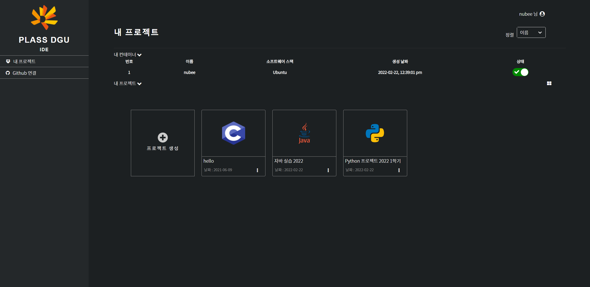
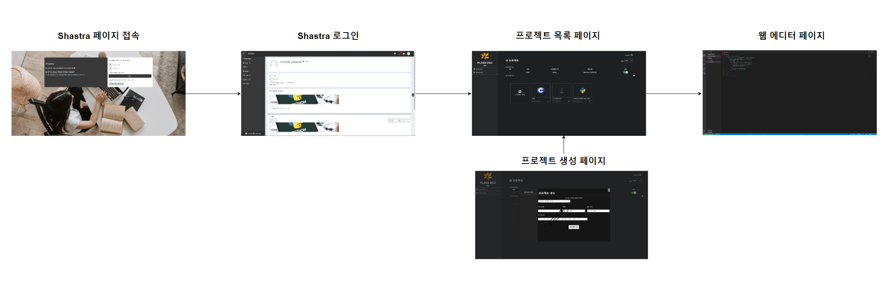
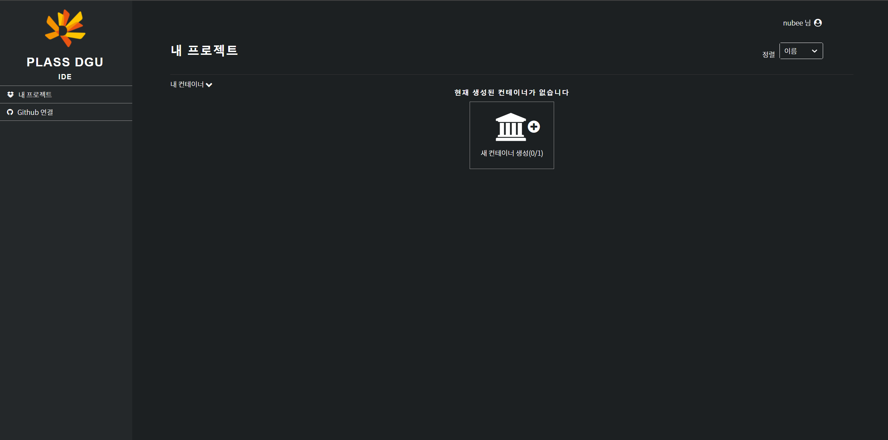
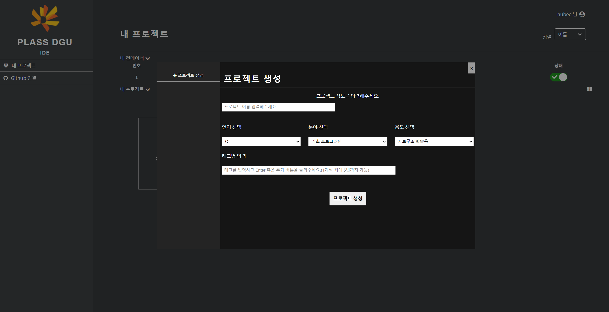
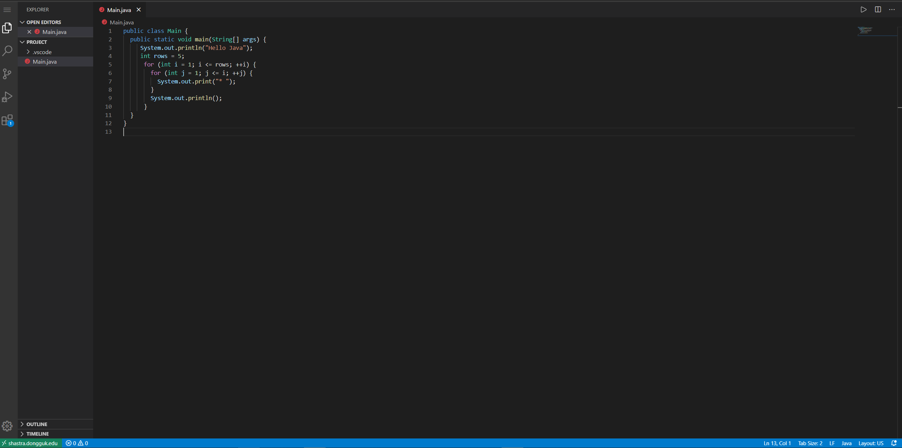

<h1 align="center" style="display: block; font-size: 2.5em; font-weight: bold; margin-block-start: 1em; margin-block-end: 1em;">
<a name="logo" href="#">
  </a>
  <br><br><strong>PLASS 프로젝트 관리 페이이지 클라이언트</strong>
</h1>


---
## 소개[](#introduction)
**프로젝트 관리 페이이지 클라이언트**라는 프로젝트는 동국대학교 PLASS 연구실 연구원들이 개발하는 프로젝트입니다.

---

## 목차[](#table-of-contents)
1. [개발 환경](#개발-환경)
2. [실행 방법](#실행-방법)
3. [기능 명세서](#기능-명세서)
3. [개발 멤버](#개발-멤버)

---

## 개발 환경[](#dev-env)
- [Node.js](https://nodejs.org/)
- [React.js](https://reactjs.org/)

## 실행 방법[](#install)
```bash

# Clone this repository
git clone `` 

# Go into the repository
cd project-client 

# Install dependencies
npm start

# .env create env file
REACT_APP_SERVER_API=http://
REACT_APP_CODE_SERVER=http://

# Run the app
$ npm start
```
> 💡 정상적으로 올리는지 확인: `open https://localhost:5110` 명령어를 사용하여 웹브라우저로 접속함 <br>
> 💡 Docker 빌드: `docker build . -t project-client:1.1`

---

## 기능 명세서[](#feature)
<div align="center">
  
  </br></br>
  <span>페이지 맵</span>
  </br>
</div>

#### 로그인 / 페이지를 유입
유저가 Moodle를 통해서 로그인해서 **웹 IDE** 클릭하면 해당 유저의 토큰을 전달하고 문제은행페이이에서 토큰을 받아서 유저정보를 다시 호출한다.
만약에 전달하는 토큰이 일치하지 않으면 해당 페이지를 나가시킬것이다.

#### 사용자 컨테이너 생성
처음에는 유저가 프로젝트 관리 페이지를 접근 시 해당 유저의 컨테이너 상태를 확인하고 만약에 생성된 컨테이너가 없으면 "새 컨테이너 생성"이라는 버튼을 클릭하면 해당 유저의 컨테이너를 생성해준다.

</br>
<div align="center">
  
</div>
</br>

#### 프로젝트 목록
유저가 "프로젝트 생성"이라는 버튼을 클릭 시 프로젝트 생성 페이지를 노출되어서 유저가 프로젝트에 대한 기존 정보를 입력하게 된다. 프로젝트 정보를 입력한 다음에 프로젝트를 생성한다.

</br>
<div align="center">
  
  </br></br>
  <span>프로젝트 정보를 입력 페이지</span>
  </br>
  </br>
  </br>
  
  </br></br>
  <span>프로젝트 목록 페이지</span>
</div>
</br>


#### 웹 에디터 페이지
유저가 접근 원하는 프로젝트를 클릭 시 해당 프로젝트 소스코드 출력하는 웹 에디터 페이지를 이동한다.

</br>
<div align="center">
  
</div>
</br>
</br>

## 개발 멤버[](#member)
- 동국대학교 PLASS 연구실 연구원

<h1 align="center" style="display: block; font-size: 2.5em; font-weight: bold; margin-block-start: 1em; margin-block-end: 1em;">
END
</h1>
